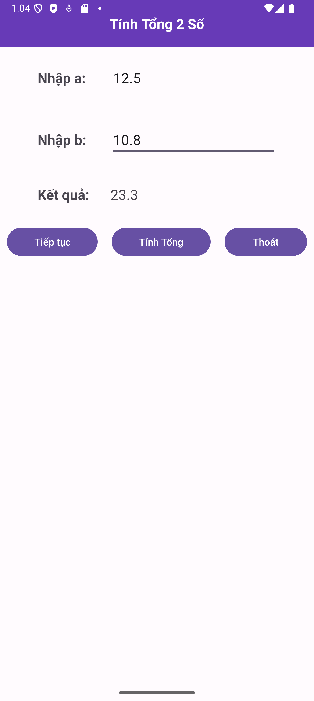
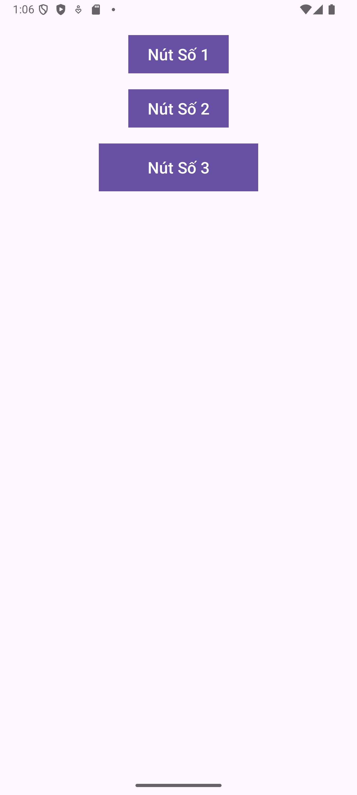
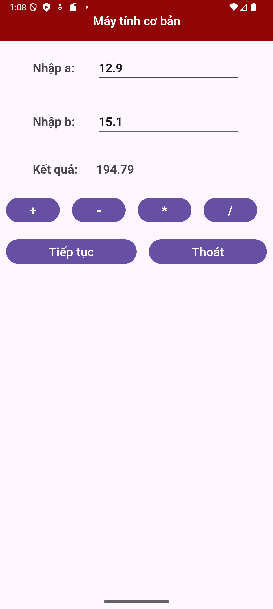

**1. Bài tập 1: Tạo và khởi chạy chương trình HelloWorld**

**2. Bài tập 2: Thiết kế giao diện và chạy chương trình cộng, trừ, nhân, chia 2 số cơ bản.**

**3. Bài tập 3: Thiết kế giao diện LinearLayout với các Button.**

**4. Bài tập 4: Thiết kế giao diện LinearLayout và các phép tính cơ bản.**

